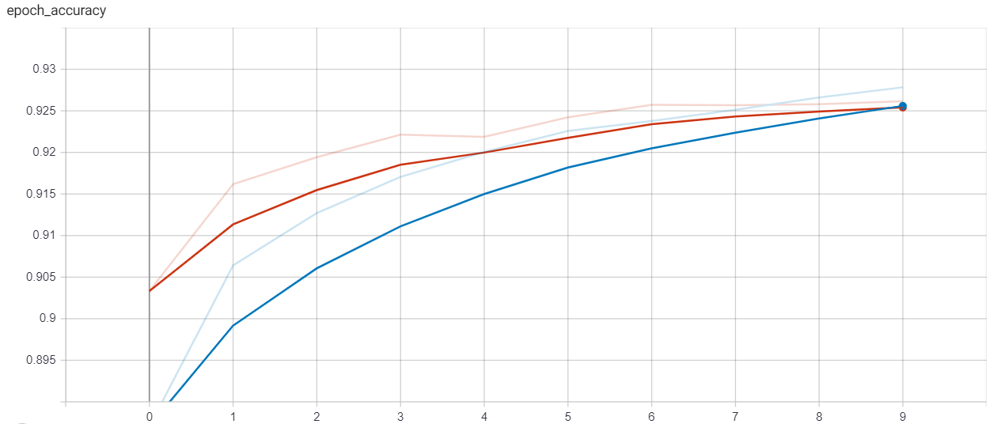
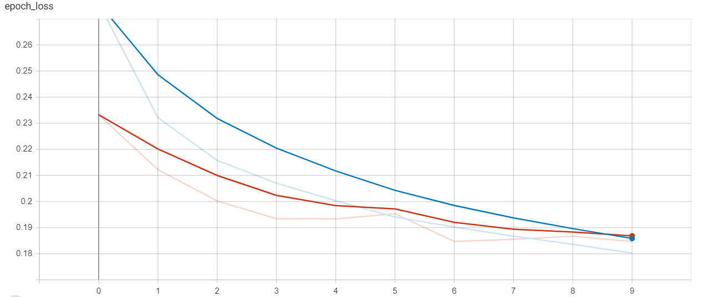

## Sentiment classification of Amazon fine food reviews
A sentiment analysis implementation on the [Amazon fine food reviews](https://www.kaggle.com/snap/amazon-fine-food-reviews) dataset.

### Overview 
In this implementation, i used pretrained word embeddings [GloVe 100d](https://nlp.stanford.edu/projects/glove/) as the input of my deep learning model using Bidirectional LSTM.

### Results on testing set
[Download model](https://github.com/ngoquanghuy99/Sentiment-classificatioin-of-Amazon-fine-food-reviews/blob/main/models/1stmodel.h5)
 *label* |*precision* | *recall* | *f1-score* | *support* | 
 | :--- | :--- | :--- | :--- | :---
 0 | 0.76 | 0.77 | 0.76| 11365
 1 | 0.96 | 0.95 | 0.96 | 61417 |
  | | | | | 
  *accuracy* |  |  | 0.93 | 72782 | 
  
## Getting started
### Install dependencies
#### Requirements
- tensorflow>=2.3.1
- keras>=2.4.3
```bash
pip3 install requirements.txt
```
### Training
```bash
python train.py
```
Accuracy graph:

Loss graph:


Fine tuning model by changing hyperparameters in `config.py`

### Testing
On the assumption that you want to predict directly
```bash
python test.py --review "this is the worst thing i\'ve ever bought"
```
Output
```python
'this is the worst thing i've ever bought' is NEGATIVE 82.63011127710342%
```


